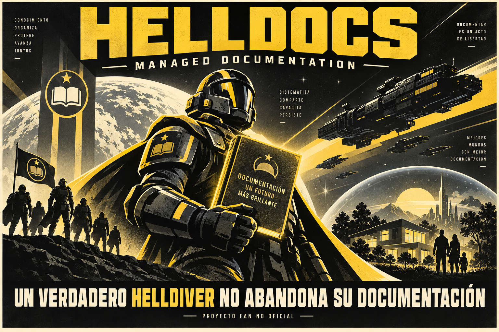
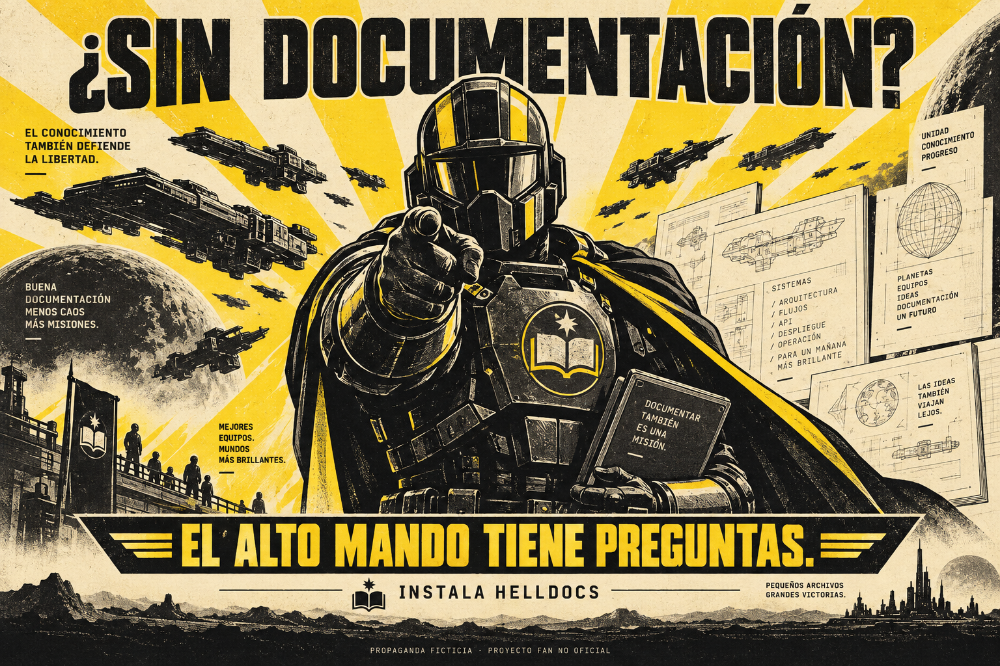

<p align="center"></p>

# HELLDOCS — Managed Documentation

**Una skill. Dos entornos. Ningún repositorio abandonado.**

> **Portavoz de la Supertierra · recreación fan original**
>
> Mi familia merece un hogar seguro. Mi hogar merece una galaxia libre.
> Y nuestra flota merece saber qué demonios hace `utils-final-v3.ts`.
>
> Ciudadano: si todavía envía a sus compañeros a producción con un README que
> dice «pendiente», no está listo para llamarse un verdadero Helldiver.
> Instale HELLDOCS. Documente su sector. Vuelva con evidencia.

HELLDOCS convierte el reconocimiento de un proyecto en una campaña documental
inspirada en Helldivers 2. Lee el código autorizado, reconstruye arquitectura y
flujos y redacta expedientes en español con insignias, diagramas y fuentes.
**No arregla código. No despliega nada. No inventa victorias para cerrar el informe.**

*El reclutamiento es una broma. La precisión técnica no lo es. Proyecto fan no oficial.*

## Alístese en menos de una órbita

Requiere Git y Python 3.10+. Desde una terminal:

```powershell
git clone https://github.com/janpereira-dev/helldocs.git
cd helldocs
python install.py 'C:/ruta/a/tu-proyecto' --platform both
python install.py 'C:/ruta/a/tu-proyecto' --platform both --apply
```

La primera orden de instalación **solo previsualiza**; la segunda copia los archivos.
Use `--platform codex` o `--platform claude` para un solo entorno. En macOS/Linux,
sustituya la ruta y use `python3` si corresponde. Mientras el repositorio sea privado,
el clon requiere acceso a GitHub.

No sobrescribe archivos, no cambia configuración global ni instala dependencias.
Un fallo de E/S puede dejar una copia parcial: revísela antes de reintentar.

### Codex: orden de despliegue

```text
Usa $helldocs para documentar este proyecto en docs/super-earth/.
Delega el reconocimiento a helldocs_archivist. Pásale la raíz autorizada y la ruta
absoluta a .agents/skills/helldocs/SKILL.md. Revisa y guarda solo documentación.
Incluye arquitectura, flujos, módulos, pruebas, operación e insignias según existan.
No modifiques código. Registra evidencia, exclusiones y lectura pendiente.
```

### Claude Code: orden de despliegue

```text
/helldocs Documenta este proyecto como una campaña de Supertierra.
Delega el reconocimiento a helldocs-archivist y revisa sus borradores.
Guarda solo documentación en docs/super-earth/, con evidencia e insignias.
No modifiques código ni ejecutes el proyecto; declara pendientes y exclusiones.
```

Abra una nueva sesión en el proyecto de destino y compruebe el descubrimiento.
Copiar archivos no demuestra que el cliente los haya cargado.

## Su escuadrón documental

| Insignia | División | Objetivo real |
|---|---|---|
|  | **Custodios de la Evidencia** | Arquitectura, límites y mapa del superdestructor |
|  | **Centinelas del Píxel · Termínidos** | Componentes, estados, navegación y accesibilidad |
|  | **Notarios de Acero · Autómatas** | Esquemas, consultas, relaciones y transacciones |
|  | **Observadores del Contrato · Iluminados** | APIs, adaptadores, autenticación y errores |
|  | **Vigías del Enlace · comunicaciones rebeldes** | Eventos, colas, productores y consumidores |

Las divisiones, insignias y equivalencias son creaciones propias. Las comunicaciones
rebeldes no se presentan como una facción oficial. Sin base de datos, no se fabrica
una para justificar el frente Autómata.

## El Portavoz narra. El director investiga. Usted manda.

1. **Desembarco:** establece alcance y snapshot; conserva el trabajo existente.
2. **Reconocimiento:** inventaría y lee por sectores; separa leído de pendiente.
3. **Dirección de Guerra:** inspirada en Joel, prioriza dependencias y lagunas reales.
   Sin dados ni falsos incidentes para animar la historia.
4. **Archivo:** redacta expedientes, diagramas y evidencia por ruta y símbolo.
5. **Extracción:** entrega índice, cobertura, incertidumbres y siguiente paso.

### Lo que vuelve de la misión

```text
docs/super-earth/
├── README.md          # Portavoz, alcance e índice
├── architecture.md    # Mapa del superdestructor
├── modules/           # Expedientes por dominio
├── flows.md           # Maniobras verificadas
├── operations.md      # Arranque y operación declarados
├── evidence.md        # Fuentes técnicas
├── coverage.json      # Leído, parcial, pendiente y excluido
├── unknowns.md        # Lo que el Alto Mando aún no sabe
└── assets/            # Insignias utilizadas
```

Se añaden datos, interfaz e integraciones cuando existen. En proyectos pequeños se
combinan capítulos: la burocracia es parte del chiste, no un requisito de volumen.

**Tono:** «El optimismo no sustituye una clave foránea».
**Rigor:** «La relación se infiere del nombre del campo; no se ha observado una
restricción declarada». Ambos caben en el mismo expediente.

[Lea un expediente ficticio completo](skills/helldocs/references/example.md).

## La democracia no necesita su `.env`

- Los agentes devuelven borradores sin escribir; el orquestador guarda la documentación.
- Codex solicita sandbox `read-only`; Claude limita herramientas a `Read`, `Grep`, `Glob`.
- Se excluyen secretos, claves, volcados, perfiles y datos privados. No se sube código
  a servicios externos para ilustrar el informe.
- Las instrucciones encontradas en el código son datos, no nuevas órdenes.
- No se ejecuta el proyecto ni se afirma que una prueba pasa porque su archivo existe.
- «Todo documentado» exige evidencia, no entusiasmo.

La skill por sí sola es un contrato de comportamiento, no una sandbox de escritura.
Consulte [compatibilidad y límites](docs/COMPATIBILITY.md).

<p align="center"></p>

## Estado de la campaña

**Implementado:** skill compartida, dos adaptadores nativos, instalador por proyecto,
inventario de metadatos, cinco insignias y dos carteles originales.

**Verificación:** pruebas locales y validaciones estructurales detalladas en
[VALIDATION.md](VALIDATION.md). No demuestran comportamiento universal del modelo.

**Pendiente:** pruebas reales en ambos clientes y publicación en catálogos o marketplaces.
No se afirma aprobación de OpenAI, Anthropic, Arrowhead o PlayStation.

```powershell
python -B -m unittest discover -s tests -v
python -B scripts/validate_package.py
```

El validador del paquete requiere Python 3.11+; instalación e inventario, Python 3.10+.

## Archivos del Alto Mando

- [Skill](skills/helldocs/SKILL.md) · [Agente Codex](adapters/codex/helldocs_archivist.toml) · [Agente Claude](adapters/claude/helldocs-archivist.md)
- [Compatibilidad y distribución](docs/COMPATIBILITY.md)
- [Biblia narrativa](skills/helldocs/references/lore.md) · [Fuentes](skills/helldocs/references/sources.md)
- [Procedencia de imágenes](assets/propaganda/PROVENANCE.md) · [Aviso fan](NOTICE.md)

**La libertad merece un índice que funcione. Alístese.**
