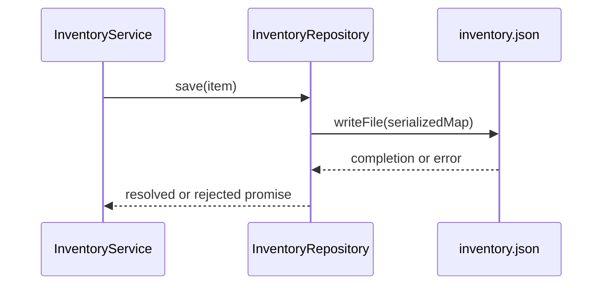

# Frente Autómata — Persistencia de inventario

> **Portavoz de la Supertierra · recreación fan original**
> Mi familia confía en nuestro hogar. Nuestro hogar confía en sus cimientos.
> Este superdestructor confía en un archivo JSON. El Ministerio ha autorizado
> una inspección documental antes de autorizar más confianza.

**Ejemplo ficticio de formato, NO hallazgo de un proyecto real.** Las coordenadas
siguientes ilustran cómo citar fuentes; no son enlaces a archivos de este paquete.

## Misión

El módulo `InventoryRepository` conserva existencias entre reinicios. Recibe un
`Item` y serializa un mapa por identificador. No implementa una base de datos SQL.

## Muestras de reconocimiento

| ID | Coordenada ficticia | Estado | Hallazgo del ejemplo |
|---|---|---|---|
| E-001 | `src/inventory/repository.ts:12–26` | observed | `save()` serializa el mapa y escribe `inventory.json` |
| E-002 | `src/inventory/service.ts:18–22` | observed | El servicio espera a `save()` antes de devolver éxito |
| E-003 | Revisión limitada a esos dos archivos | unknown | No se ha establecido coordinación entre procesos |

## Maniobra — Flujo de escritura

**Lectura técnica:** esperar la promesa no demuestra atomicidad ni protección
contra escrituras concurrentes. Eso requiere evidencia adicional.

**Parte del frente:** el optimismo no sustituye una clave foránea. En este ejemplo
ni siquiera hay una tabla: el uniforme Autómata es solo la metáfora del capítulo.

## Orden siguiente

Revisar inicialización, manejo de errores y pruebas del repositorio. No ejecutar
migraciones ni cambiar la persistencia. Estado de extracción: **parcial**.
