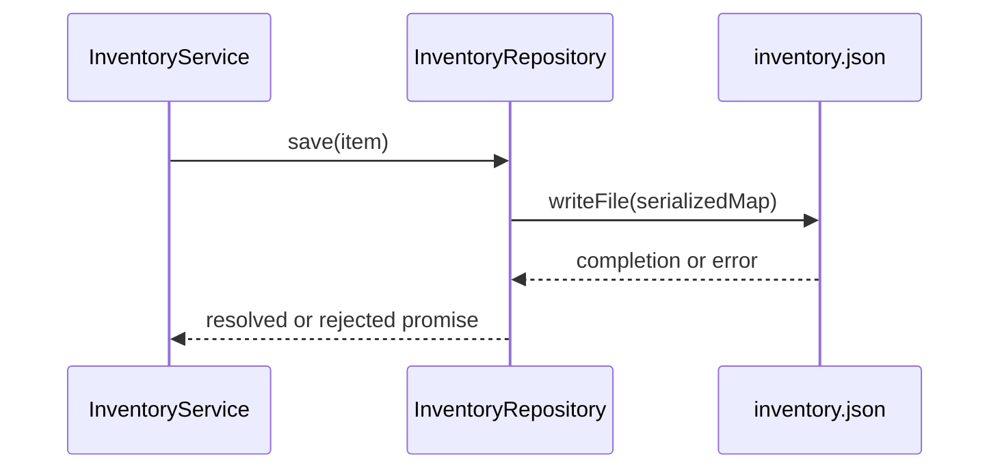

# Automaton Front — Inventory persistence

> **Super Earth Spokesperson · original fan recreation**
> My family trusts our home. Our home trusts its foundations.
> This Super Destroyer trusts a JSON file. The Ministry has authorized a
> documentation inspection before authorizing additional trust.

**Fictional format example, NOT a finding from a real project.** The following
coordinates illustrate citation format; they are not links to files in this package.

## Mission

`InventoryRepository` persists inventory between restarts. It accepts an `Item`
and serializes a map keyed by identifier. It does not implement a SQL database.

| ID | Fictional coordinate | State | Example finding |
|---|---|---|---|
| E-001 | `src/inventory/repository.ts:12–26` | observed | `save()` serializes the map into `inventory.json` |
| E-002 | `src/inventory/service.ts:18–22` | observed | Service awaits `save()` before reporting success |
| E-003 | Inspection limited to those two files | unknown | Coordination between processes is not established |

## Maneuver — Write flow

**Technical reading:** awaiting a promise does not establish atomicity or protection
against concurrent writes. Additional evidence is required.

**Front report:** optimism does not replace a foreign key. There is not even a table
in this example: the Automaton uniform is only this chapter's metaphor.

## Next order

Inspect startup, error handling and repository tests. Do not run migrations or
change persistence. Extraction status: **partial**.
